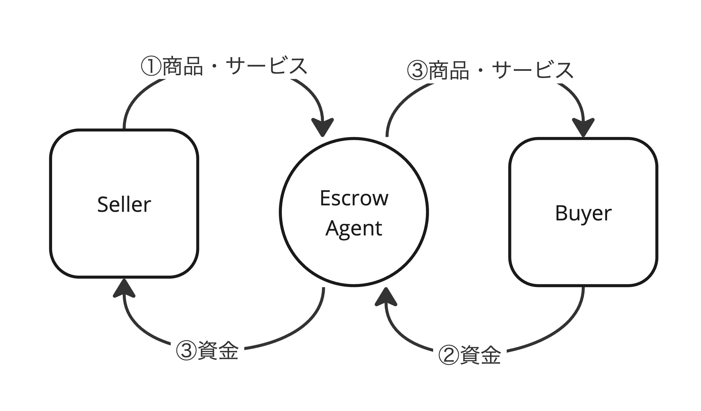
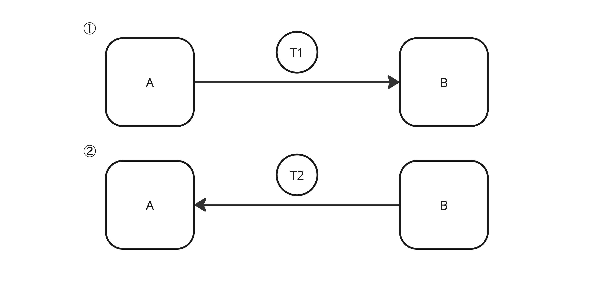
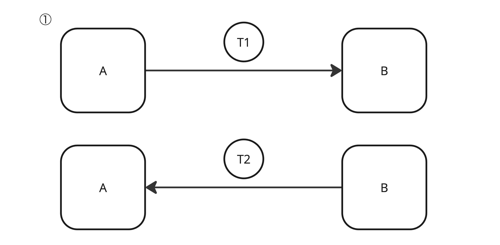
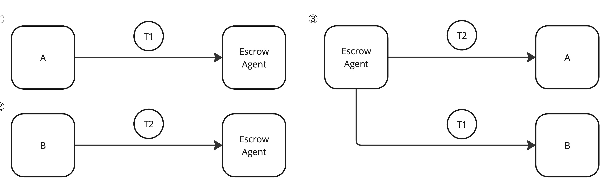
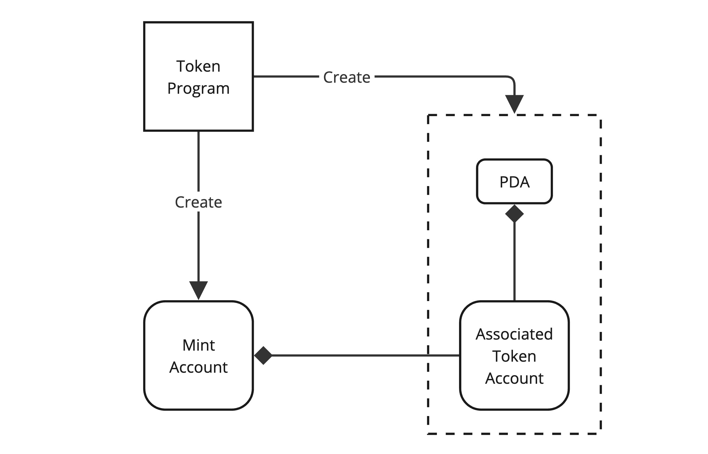
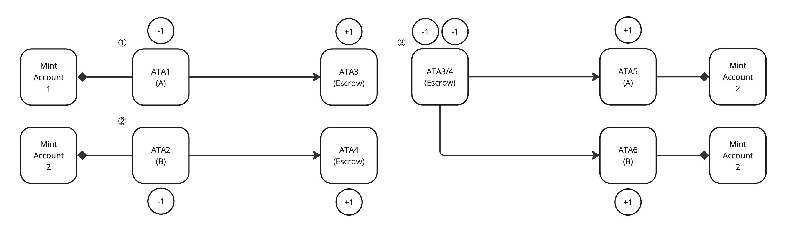
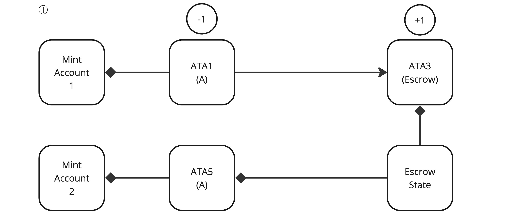
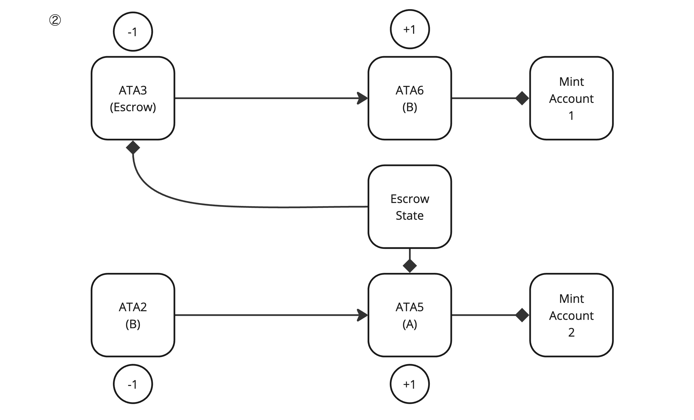
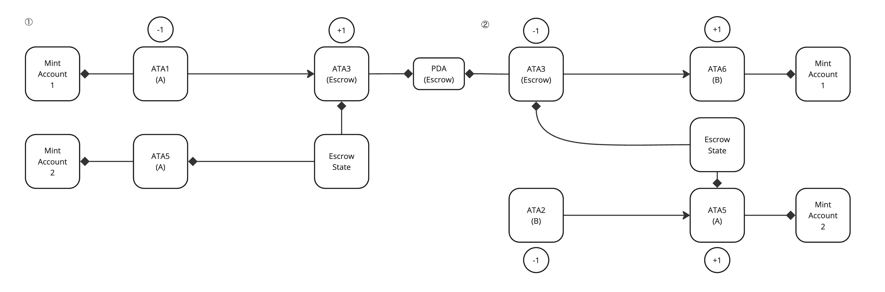

# 2. エスクローとは

エスクローの主な目的は、以下の2点です。

1. 買い手の保護：買い手は、商品やサービスを受け取る前に支払いを完了させるリスクを負いません。 エスクローエージェントが資金を保管することで、売り手が商品を引き渡さない場合でも、買い手は資金を失うことがありません。
2. 売り手の保護：売り手は、商品やサービスを提供する前に支払いを受け取ることができます。 これにより、買い手が支払いを行わないリスクを軽減できます。

-

エスクローの概念自体は古くからありますが、特に不動産取引において広く使われてきました。
不動産取引では、大金が動くことが多いため、買い手と売り手の間で信頼関係を築くのが難しい場合があります。
そこで、銀行や法律事務所などの第三者がエスクローエージェントとして間に入り、取引が完了するまで資金や権利書などを保管します。

つまり、エスクローとは、AからBへの送信、BからAへの送信という交換を安全に行うための仕組みです。

## 2.1. 安全な交換アルゴリズム

まず、一番シンプルな交換について考えてみましょう。



図の通り、AからBにT1を送信し、その後にBからAにT2を送信します。
これでも交換自体は成り立ちますが、いくつか安全ではないケースが起こりえます。

1. ①でBがAからT1を受け取ったあとに②を実行しない
2. ①でAからBに送られたT1が、Bの期待したT1ではない
3. ②でBからAに送られたT2が、Aの期待したT2ではない

つまり、このシンプルなケースでは、AとB（特にA）がリスクを負った交換しなければなりません。
もちろん、交換の対象によってはリスクは許容できるかもしれませんが、安全に交換できるならそちらの方が望ましいのは確かです。

それでは、シンプルな交換と違い、AとBで同時に送信するケースはどうでしょうか。



このケースでは、シンプルな交換のリスクを軽減して互いに送信するので、送られないという問題を回避できます。
しかし、交換するT1、T2が期待したものであるかどうかは保証できません。
（本書では扱いませんが、1つのトランザクションで部分署名を行い、AとBでトランザクションを共有することで、問題点を全て改善した安全な交換を実現できます。
ただし、この方法ではAとBの間でトランザクションを受け渡す必要があり、仕組みとして複雑になります）

次に、エスクローエージェントを使った方法を見てみましょう。



まず、AはBではなくエスクローエージェントにT1を預けます。
次に、BもエスクローエージェントにT2を預け、それがエスクローエージェントに適切だと判定されたら、エスクローエージェントからAとBにT1とT2を送信します。

仮にBがエスクローエージェントにT2を預けなければ、この交換は実行されません。
また、A、またはBが適切なT1、T2をエスクローエージェントに預けない場合にも交換は実行されないため、安全に交換できます。

シンプルな交換と比べると、エスクローエージェントという概念が増えるため複雑にはなりますが、より安全な交換を実現できます。

## 2.2. トークンプログラムを使ったエスクロー

エスクローの動きがわかったところで、これをどのようにSolanaブロックチェーンの概念に当てはめていくのかを見ていきましょう。

本書では、T1、T2にあたる交換の対象として、SPLトークンを扱います。
SPLトークンは、SolanaのStandard Program Libraryと呼ばれる、Solana Labsが開発しているSolanaの標準的なプログラム群の一部であるトークンプログラムで発行されたトークンのことを指します。
（もちろん、エスクローでトークンを扱わない、SPL以外のトークンを使うこともできますが、本書では解説のしやすさからSPLトークンを使って解説します）

このトークンプログラムが扱うアカウントには、2種類のアカウントがあります。



1つ目は、ミントアカウントと呼ばれる、Solanaブロックチェーン上に1つだけ存在するアカウントです。

```rust
pub struct Mint {
    pub mint_authority: COption<Pubkey>,
    pub supply: u64,
    pub decimals: u8,
    pub is_initialized: bool,
    pub freeze_authority: COption<Pubkey>,
}
```

Rust上では上記のように定義され、このミントアカウントではトークン自体を表し、トークンに関する情報や、トークンの発行量などを管理します。

2つ目は、関連トークンアカウント（ATA）と呼ばれる、Solanaブロックチェーン上で複数存在するアカウントです。

```rust
pub struct Account {
    pub mint: Pubkey,
    pub owner: Pubkey,
    pub amount: u64,
    pub delegate: COption<Pubkey>,
    pub state: AccountState,
    pub is_native: COption<u64>,
    pub delegated_amount: u64,
    pub close_authority: COption<Pubkey>,
}
```

この関連トークンアカウントでは、トークンの所有を表し、どのアカウントがどれだけそのトークンを保有しているかといった情報を管理します。

このアカウント構造を見ると、トークンを送信するという行為は、トークンプログラムでAの関連トークンアカウントで保有している数量を減らし、Bの保有している数量に足すという行為だとわかります。

先ほどのエスクローの図に関連トークンアカウントを当てはめると、このような図になります。



少し複雑なので1つずつ見ていきましょう。

まず、Aからエスクローエージェントへの送信です。
このときAはミントアカウント1に対応した関連トークンアカウント1を所有し、エスクローエージェントはミントアカウント1に対応した関連トークンアカウント3を所有します。
トークンプログラムを用いて関連トークンアカウント1から数量をマイナスし、関連トークンアカウント3に数量をプラスします。

次に、Bからエスクローエージェントへの送信です。
このときBはミントアカウント2に対応した関連トークンアカウント2を所有し、エスクローエージェントはミントアカウント2に対応した関連トークンアカウント4を所有します。
トークンプログラムを用いて関連トークンアカウント2から数量をマイナスし、関連トークンアカウント4に数量をプラスします。

最後に、エスクローエージェントからAとBへの送信です。
このときAはミントアカウント2に対応した関連トークンアカウント5を所有し、Bはミントアカウント1に対応した関連トークンアカウント6を所有します。
トークンプログラムを用いて、エスクローエージェントの関連トークンアカウント3からAの関連トークンアカウント5へ、エスクローエージェントのトークンアカウント4からBの関連トークンアカウント6へ数量を移動させます。

このように、Solanaブロックチェーンでのエスクローは、関連トークンアカウント間の数量の移動で表されます。

## 2.3. プログラムを使ったエスクロー

ここまでの解説で、エスクローの仕組みの中核にエスクローエージェントがいることがわかります。

では、このエスクローエージェントは誰が担うのでしょうか。
例えば、従来のエスクローのように銀行や法律事務所などの第三者がエスクローエージェントとして入ることは可能です。
しかし、第三者が入る場合、その第三者が不正やミスにより安全ではない取引を行えないように、別の仕組みの構築が求められます。

また、第三者が入ることで処理に時間がかかり、コストがかかるようになり、そのコストをどのように回収するのかを考える必要が出てきます。

そこで、機械的にエスクローを行い、安全で、高速で、コストをかけずに実行できるようにプログラムを用意します。
これにより、AとBだけで安全なエスクローを実現できるようになります。



まずはAが実行する処理です。
主にやらなければいけない処理は3つあります。

1. エスクロープログラムが所有する関連トークンアカウントを作成する
2. Aの所有する関連トークンアカウントから、エスクロープログラムが所有する関連トークンアカウントにトークンを送信する
3. Bが取引するのに必要な情報を持つエスクローアカウントを作成する

3で作成するエスクローアカウントには、取引ができるように受け取るトークンの数量や、Bの送信先になる関連トークンアカウントなどを含めます。
ここでエスクローアカウントに何のトークンを受け取るのかの指定がないのが気になるかもしれませんが、関連トークンアカウントにどのトークンなのか情報が含まれており、一致したトークンでなければBの処理に失敗するため、特に保持する必要はありません。



次にBが実行する処理です。

1. エスクローアカウントを元に、エスクロープログラムが所有する関連トークンアカウントからBにトークンを送信
2. エスクローアカウントを元に、BからAにトークンを送信
3. 後始末として不要になったエスクローアカウントと関連トークンアカウントを削除

Bではエスクローアカウントを元に取引を実行します。
このときにBからAに期待する数量になっていないトークンや、違うトークンを送信をしようとすると失敗します。

このようにエスクロープログラムを用意することで、AとBだけで安全な取引ができるようになります。

## 2.4. Program Derived Addressの利用

エスクロープログラムの導入で安全な取引ができるようになりましたが、1つ問題があります。
それは、トークンプログラムを利用してトークンの転送をする際に署名が必要になるということです。

1. Aからエスクロープログラムが所有する関連トークンアカウントに転送する（署名できる）
2. BからAが所有する関連トークンアカウントに転送する（署名できる）
3. エスクロープログラムからBが所有する関連トークンアカウントに転送する（署名できない）

プログラム自体は鍵を持たないため署名する能力を持たず、先の処理を実現できません。

そこで必要になるのがPDA（Program Derived Address）です。

SolanaブロックチェーンでPDAは主に3つの目的で使われます。

1. プログラムによる署名が必要なときに
2. 一意なアカウントにしたいとき
3. 一意なデータからアカウントを参照したいとき

今回は、エスクロープログラムで署名が必要になるため、1の用途で利用します。
余談ですが、2、3はSPLのネームサービスで名前空間とアドレスの紐付けのように、一意の名前空間を作るために利用されています。
トークンプログラムでもPDAが使われることがありますが、これは3の用途です。



エスクロープログラムで署名できるようにするには、エスクロープログラムが所有する関連トークンアカウントの作成時に、所有者にPDAで作成したアドレスを設定しましょう。
このPDAで作成したアドレスを利用して、Bの処理の際にエスクロープログラムで署名し、Bにトークンを送信します。

## 2.5. より具体的なトランザクションとインストラクション

ここまでの解説でエスクローの開発はできますが、より確実に開発できるように具体的な解説をしていきます。

原則として プログラム名(インストラクション名): 解説 という形で記載します。
具体的にそれぞれのトランザクションでどのプログラムのインストラクションが呼ばれるかを意識してください。

### Aのトランザクション

Aのトランザクションでは、エスクロープログラムの所有する関連トークンアカウントに一時的に預け入れ、取引内容をエスクローアカウントに保存します。

1. システムプログラム (CreateAccount): 空のアカウントを作成 (関連トークンアカウント用)
2. トークンプログラム (InitializeAccount): 1で作成した空のアカウントを関連トークンアカウントとして初期化
3. トークンプログラム (Transfer): Aが所有しているアカウントから2で初期化した関連トークンアカウントにトークンを送信
4. システムプログラム (Create Account): 空のアカウントを作成（エスクローアカウント用）
5. エスクロープログラム (Initialize):
   1. エスクローアカウントを初期化
   2. PDAでプログラムで利用できるアドレスを生成
   3. トークンプログラム (Set Authority): 2で作成した関連トークンアカウントの所有者をPDAのアドレスに変更

1と2は関連トークンアカウントを作成するための定型処理になります。
システムプログラムと呼ばれる、SPLで定義された基本的なアカウント操作のプログラムを用いて、空のアカウントを作成し、関連トークンアカウントとして初期化します。

空の関連トークンアカウントができたら、3で1、2で作成した関連トークンアカウントにトークンを預け入れます。
注意点として、このインストラクションまでは関連トークンアカウントの所有者はまだAになっています。
これは2のタイミングで作成した人が所有者になっているためです。

最後にエスクロープログラムを呼び出し、取引を初期化します。
このタイミングでSolanaブロックチェーンの機能のCPI（Cross Program Invocation）でトークンプログラムを呼び出し、関連トークンプログラムの所有者を変更します。
所有者をPDAで生成したアドレスにするためには、ここでのCPIの利用が必須です。

1、2、3の内容を4のエスクロープログラム内でCPIで実現できます。
しかし、なぜそうはなっていないのかというと、筆者の想像ですが、CPIを利用しなくて良いところは利用しないというプラクティスがあるのではないかと考えています。

まず、再利用性の観点から、CPI自体に深さ4までの制限があるため、多用すると他のプログラムから利用しにくくなってしまいます。

また、セキュリティの観点から、CPIを利用するとユーザーから処理の内容が見えにくくなるというのがあります。
これは、Token Extensionで導入されたCPI Guardで言及されていることですが、ユーザーからはCPIが実行したトランザクションが見えず、Simulation Transactionでどのような変化が起きたかでしか確認できません。

そのため、CPIを利用せずに済むところはCPIを利用しないというプラクティスがあると考えています。

### Bのトランザクション

Bのトランザクションでは、エスクロープログラムを利用して取引を成立させます。

1. エスクロープログラム (Exchange)
   1. 取引の妥当性を検証
   2. トークンプログラム (Transfer): BからAにトークンを送信
   3. トークンプログラム (Transfer): エスクロープログラムからBにトークンを送信
   4. トークンプログラム (CloseAccount): エスクロープログラムが所有する関連トークンアカウントを削除
   5. エスクローアカウントを削除

Bではエスクロープログラム上で全ての処理をします。
これは、1と2がセットであり2だけを単独で実行できないこと、3、4、5はエスクロープログラムからしか実行ができないためです。
そのため、CPIの利用が必須であり、AのトランザクションのようにCPIを利用しないで実現する方法がないためです。

## 2.6. 章のまとめ

この章では、Solanaブロックチェーンでエスクローをどのように実現するかについて解説しました。

エスクローの概念自体は古くからありましたが、ブロックチェーン上でエスクローを実現することで、高い透明性と改ざん耐性を持った安全な取引が可能になります。
Solanaブロックチェーンでは、トークンプログラムを利用して関連トークンアカウント間の数量移動によりエスクローを表現します。
さらに、エスクロープログラムを導入することで、AとBだけで安全に取引ができるようになります。

エスクロープログラムでは、PDAを利用することで、プログラムによる署名を可能にし、トークンの転送を実現します。
具体的なトランザクションとインストラクションの流れを理解することで、エスクローの開発がより確実になります。

次章から実際にエスクローをSolanaブロックチェーンで開発する方法の解説を進めていきます。
Solanaブロックチェーンに慣れた方であれば、ここまでの解説で開発できますので、読み進める前に一度開発をしてみて、答え合わせとして次章以降を読むことをおすすめします。
